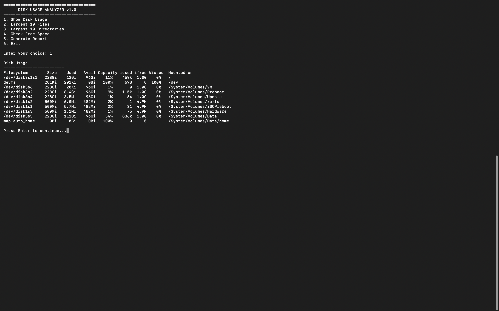

# 💽 Disk Usage Analyzer

A Bash-based Disk Usage Analyzer that helps Linux users monitor disk usage, identify large files/directories, check free space, and generate reports.

---

## 📸 Screenshots

### Main Menu


---

### Sample Output



---

## 📌 Overview

Disk Usage Analyzer is a Linux Bash scripting project that provides useful disk usage statistics through a menu-driven interface. It helps system administrators and DevOps engineers quickly identify storage consumption and monitor available disk space.

---

## 🚀 Features

- Show Disk Usage
- Largest 10 Files
- Largest 10 Directories
- Check Free Disk Space
- Generate Disk Usage Report
- Menu-driven Interface

---

## 🛠 Technologies

- Bash
- Linux Commands
- Shell Scripting
- Git
- GitHub

---

## 📂 Project Structure

```text
disk-usage-analyzer/
│
├── scripts/
│   └── analyzer.sh
│
├── screenshots/
│   ├── main-menu.png
│   └── output.png
│
├── docs/
├── disk_report.txt
├── README.md
└── LICENSE
```

---

## ▶️ How to Run

```bash
chmod +x scripts/analyzer.sh
cd scripts
./analyzer.sh
```

---

## 🎯 Use Cases

- Linux System Administration
- Disk Space Monitoring
- Server Maintenance
- DevOps Practice
- Learning Bash Scripting

---

## 👨‍💻 Author

**Rohan Tundalwar**

Aspiring DevOps Engineer | Linux | Bash | Git | AWS
